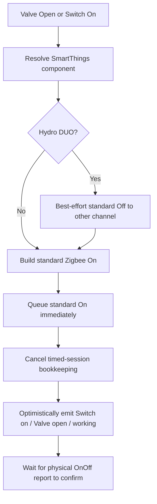
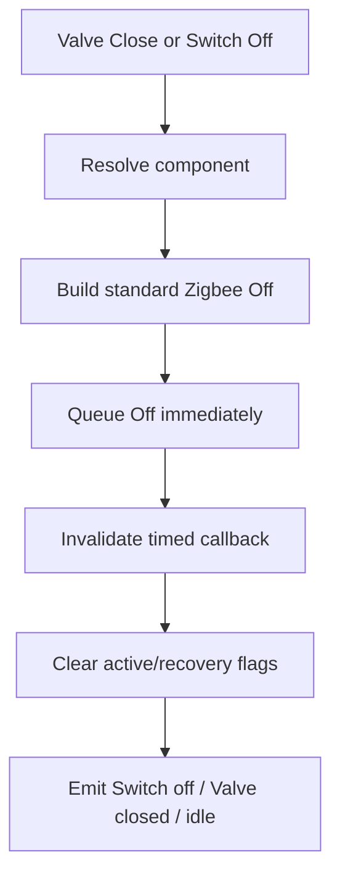
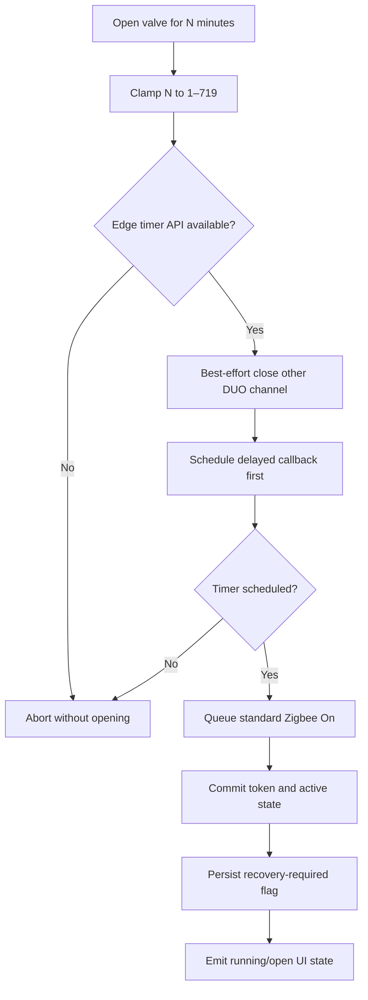
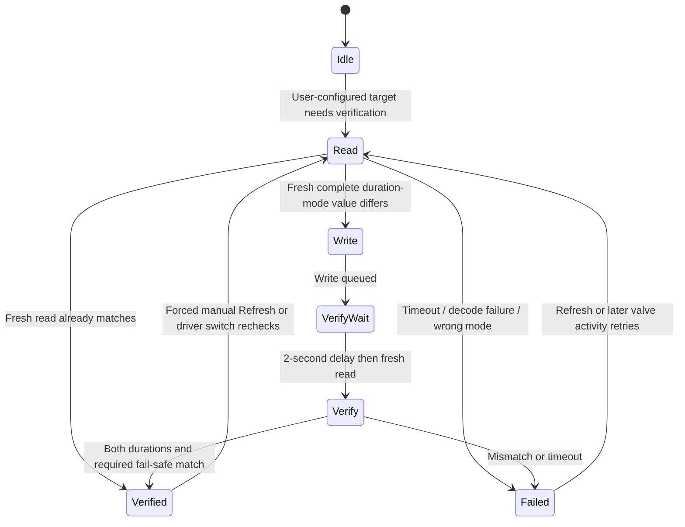
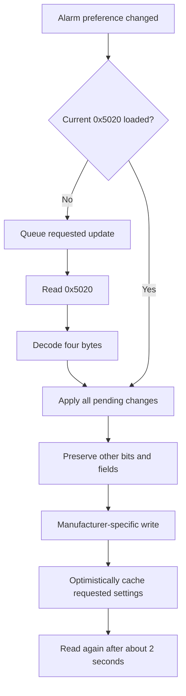

# SONOFF Hydro ONE / Hydro ONE Lite / Hydro DUO
## SmartThings Edge Driver — Complete Technical Documentation

**Driver version:** `v1.4.0-alpha29`  
**Package key:** `sonoff-hydro-one`  
**Driver namespace:** `oceancircle09600`  
**Documentation date:** 2 August 2026  
**Status:** Supervised alpha / hardware validation in progress  
**Source baseline:** `v1.4.0-alpha29` reviewed driver package  
**Repository directory:** `sonoff-hydro`

> [!IMPORTANT]
> Alpha29 is the current and best development baseline. Its reliability-first architecture is designed so that ordinary Valve Open/Close and Switch On/Off remain simple standard Zigbee commands, while SONOFF-specific features operate independently. The package has extensive static and mocked-runtime validation, but it still requires real-device testing—particularly for the device-side watering limit and Hydro DUO.

---

## Table of contents

1. [Purpose and scope](#1-purpose-and-scope)
2. [What this driver is](#2-what-this-driver-is)
3. [Supported devices](#3-supported-devices)
4. [Current project state](#4-current-project-state)
5. [Design principles](#5-design-principles)
6. [Package structure](#6-package-structure)
7. [SmartThings model](#7-smartthings-model)
8. [Feature and capability matrix](#8-feature-and-capability-matrix)
9. [Settings and preferences](#9-settings-and-preferences)
10. [Zigbee protocol model](#10-zigbee-protocol-model)
11. [Standard control code paths](#11-standard-control-code-paths)
12. [Custom timed-watering code path](#12-custom-timed-watering-code-path)
13. [Device-side watering limit and the ten-minute issue](#13-device-side-watering-limit-and-the-ten-minute-issue)
14. [Lifecycle handlers](#14-lifecycle-handlers)
15. [Refresh and device configuration](#15-refresh-and-device-configuration)
16. [Incoming reports and telemetry](#16-incoming-reports-and-telemetry)
17. [Child lock](#17-child-lock)
18. [Alarm and auto-close settings](#18-alarm-and-auto-close-settings)
19. [Hydro DUO architecture](#19-hydro-duo-architecture)
20. [Custom capabilities and SmartThings routines](#20-custom-capabilities-and-smartthings-routines)
21. [Internal state and persistence](#21-internal-state-and-persistence)
22. [Error handling and defensive parsing](#22-error-handling-and-defensive-parsing)
23. [Installation and deployment](#23-installation-and-deployment)
24. [Operation guide](#24-operation-guide)
25. [Logging and troubleshooting](#25-logging-and-troubleshooting)
26. [Hardware test plan](#26-hardware-test-plan)
27. [Known limitations and open issues](#27-known-limitations-and-open-issues)
28. [Comparison with the stock driver and other integrations](#28-comparison-with-the-stock-driver-and-other-integrations)
29. [Development history and context](#29-development-history-and-context)
30. [Safe future-development policy](#30-safe-future-development-policy)
31. [Source-code map](#31-source-code-map)
32. [External references](#32-external-references)
33. [Glossary](#33-glossary)

---

# 1. Purpose and scope

This document describes the complete current design and behavior of the community SmartThings Edge Driver for the SONOFF Hydro family:

- Hydro ONE with flow meter
- Hydro ONE Lite without flow meter
- Hydro DUO with two independently addressable outlets and a shared flow meter

It is intended for:

- users and testers who have never seen the project before;
- SmartThings Edge developers reviewing or extending the driver;
- maintainers who need to understand why particular safety and reliability decisions were made;
- people comparing the driver with the official SmartThings stock driver, Zigbee2MQTT, ZHA, deCONZ, or the eWeLink integration;
- anyone investigating the device’s approximately ten-minute default manual-watering cutoff.

The document covers:

- supported hardware;
- SmartThings profiles and custom capabilities;
- every major command and report path;
- the SONOFF private Zigbee cluster and implemented attributes;
- timers and restart recovery;
- device settings and write verification;
- open issues and confidence levels;
- installation, logging, testing, and troubleshooting;
- historical context and the rules that should govern future changes.

This document does **not** claim that every private function has already been proven on every device and firmware. Where hardware evidence is incomplete, that is stated explicitly.

---

# 2. What this driver is

SmartThings Edge Drivers are Lua programs that run locally on compatible SmartThings hubs. They translate between SmartThings Capabilities and a device protocol such as Zigbee. SmartThings defines an Edge Driver through its Lua code, configuration, fingerprints, profiles, capabilities, lifecycle handlers, and protocol handlers. See the official [SmartThings Edge architecture](https://developer.smartthings.com/docs/devices/hub-connected/edge-architecture), [driver structure](https://developer.smartthings.com/docs/devices/hub-connected/driver-components-and-structure), and [Zigbee driver reference](https://developer.smartthings.com/docs/edge-device-drivers/zigbee/driver.html).

This driver performs two distinct jobs:

1. **Reliable standard control**
   - Open a valve with the standard Zigbee On command.
   - Close a valve with the standard Zigbee Off command.
   - Decode the standard On/Off state and battery level.

2. **SONOFF-specific enhancement**
   - Read and write the private eWeLink/SONOFF cluster `0xFC11`.
   - Expose irrigation duration, volume, work state, alerts, child lock, alarm settings, firmware-dependent water-flow units, and the device-side manual-watering limit.
   - Add driver-managed timed watering and restart recovery.
   - Represent both Hydro DUO channels as SmartThings components.

The central design rule is that the second job must never make the first job unreliable.

---

# 3. Supported devices

## 3.1 Fingerprints

The driver fingerprints the following manufacturer/model combinations from `fingerprints.yml`:

| Product family | Zigbee manufacturer | Model identifier | SmartThings profile | Driver label |
|---|---:|---|---|---|
| Hydro ONE, EU | `SONOFF` | `SWV-ZFE` | `sonoff-hydro-one` | SONOFF Hydro ONE |
| Hydro ONE, US | `SONOFF` | `SWV-ZFU` | `sonoff-hydro-one` | SONOFF Hydro ONE |
| Hydro ONE Lite, EU | `SONOFF` | `SWV-ZNE` | `sonoff-hydro-one-lite` | SONOFF Hydro ONE Lite |
| Hydro ONE Lite, US | `SONOFF` | `SWV-ZNU` | `sonoff-hydro-one-lite` | SONOFF Hydro ONE Lite |
| Hydro DUO, generic | `SONOFF` | `SWV-ZF2` | `sonoff-hydro-duo` | SONOFF Hydro DUO |
| Hydro DUO, EU | `SONOFF` | `SWV-ZF2E` | `sonoff-hydro-duo` | SONOFF Hydro DUO |
| Hydro DUO, US | `SONOFF` | `SWV-ZF2U` | `sonoff-hydro-duo` | SONOFF Hydro DUO |

## 3.2 Product-family differences

| Characteristic | Hydro ONE | Hydro ONE Lite | Hydro DUO |
|---|---|---|---|
| Flow meter | Yes | No | Yes, shared |
| Controllable outlets | 1 | 1 | 2 |
| SmartThings components | `main` | `main` | `main`, `channel2` |
| Current/hourly volume | Yes | No | Yes, device-wide on `main` |
| Abnormal-state alerts | Exposed | Not exposed | Exposed, aggregated |
| Water Sensor capability | Yes | No | Yes, shared |
| `0x5020` alarm settings | Full supported subset | Not used | Conservative subset |
| Device-side fail-safe field | Written with selected limit | Preserved | Written with selected limit |

SONOFF markets Hydro ONE as a Zigbee 3.0 valve with a flow meter and Hydro ONE Lite as the equivalent family without a flow meter. Hydro DUO provides two independently controlled irrigation zones. The EU and US model variants mainly differ in their water-thread standards, while the driver treats the regional variants of a family identically. See the official product pages for [Hydro ONE](https://sonoff.tech/en-de/products/sonoff-hydro-series-hydro-one-zigbee-smart-water-valve-swv-zfu-swv-zfe), [Hydro ONE Lite](https://sonoff.tech/en-de/products/sonoff-hydro-series-hydro-one-lite-zigbee-smart-water-valve-swv-znu-swv-zne), and [Hydro DUO](https://sonoff.tech/en-de/products/sonoff-hydro-duo-dual-channel-zigbee-smart-water-valve-swv-zf2e-swv-zf2u).

## 3.3 Physical and environmental context

The driver does not enforce installation specifications. Users must follow the SONOFF manual and product documentation. Relevant Hydro ONE product information includes Zigbee 3.0 connectivity, four AA batteries, IP55 enclosure rating, specified water-pressure and temperature ranges, and correct flow direction. SONOFF also warns that low flow may be interpreted as a water-shortage condition; its Hydro ONE FAQ states that flow below approximately 5 L/min can cause a “No Water” detection and optional automatic closure.

The SmartThings driver cannot correct unsuitable plumbing, reverse installation, insufficient flow, weak batteries, radio interference, frozen water, or a firmware-level protection event.

---

# 4. Current project state

## 4.1 Current baseline

`v1.4.0-alpha29` is the current baseline and the strongest version produced so far.

Its defining properties are:

- standard Open/Close paths are deliberately simple;
- custom timed watering is independent of private configuration;
- the device-side watering limit is synchronized separately;
- both duration fields in `0x501D` are updated;
- Hydro ONE and Hydro DUO also receive a matching fail-safe duration;
- the driver verifies the relevant fields through a fresh readback;
- a private write failure cannot block standard On/Off;
- the full feature set and profiles from alpha28 are retained.

## 4.2 Validation already performed

The package contains:

- a static validator (`scripts/validate_static.py`);
- a Lua syntax-check helper (`scripts/check_lua_syntax.lua`);
- a mocked runtime suite (`scripts/test_alpha29_runtime.lua`);
- a hardware test plan (`TESTING.md`);
- a code-review report (`CODE_REVIEW.md`).

The packaged review records:

- Lua syntax parsing passed;
- static architecture validation passed;
- 38 mocked runtime scenarios passed;
- standard Open/Close isolation passed;
- timed-watering and restart-recovery regressions passed;
- full-model dual-duration and fail-safe payload checks passed;
- Lite byte-preservation checks passed;
- timeout, retry, stale-response, and preference-change checks passed;
- DUO endpoint and alert regressions passed;
- YAML and JSON parsing passed;
- ZIP integrity passed.

## 4.3 What is not yet proven

Automated tests cannot prove that a physical SONOFF valve:

- accepts the exact private write on every firmware;
- retains the new value after a restart or battery replacement;
- applies the value to manual operation started through SmartThings or the physical button;
- behaves identically across SWV-ZNE, SWV-ZFE, SWV-ZF2, and all regional variants;
- reports all private telemetry reliably while sleeping;
- exposes the same private semantics on both Hydro DUO channels.

The ten-minute issue therefore remains **implemented but awaiting complete alpha29 hardware confirmation**.

## 4.4 Confidence matrix

| Area | Code confidence | Hardware confidence | Current statement |
|---|---:|---:|---|
| Standard Valve Open/Close | High | Needs alpha29 regression test | Architecture matches standard Zigbee control |
| Standard Switch On/Off | High | Needs alpha29 regression test | Same path as Valve commands |
| State reconciliation from OnOff reports | High | Previously observed on family | Standard behavior |
| Driver-side timed watering | High | Short supervised test required | Timer logic is isolated and tested |
| Restart recovery | High in code | Hub/device test required | Sends one standard Off after interrupted run |
| `0x501D` encoding and verification | High against current integration model | Not fully proven on alpha29 hardware | Corrected in alpha29 |
| Beyond-ten-minute physical runtime | Not provable by mocks | Pending | Do not call fixed until timed physically |
| Child lock | Medium | Model/firmware testing required | Manufacturer-specific private write |
| Private telemetry | Medium | Firmware-dependent | Defensive parsing implemented |
| `0x5020` alarm settings | Medium/experimental | Needs supervised tests | Read-modify-write implemented |
| Hydro DUO | Medium in code | Incomplete | Alpha support |

---

# 5. Design principles

## 5.1 Reliability boundary

The driver separates **standard control** from **private enhancement**.

The following paths must not read, write, wait for, or verify `0x501D`:

- Valve Open
- Valve Close
- Switch On
- Switch Off
- Custom Open for Minutes
- Automatic Off at the end of a driver-side timed session

This rule is enforced by code structure and the static validator.

## 5.2 Command first, bookkeeping second

For ordinary On and Off, the Zigbee command is queued before timer cleanup or optimistic UI updates. If a secondary event emission fails, it cannot undo the already queued physical command.

A genuine `device:send()` or `send_to_component()` failure is intentionally allowed to surface. The driver should not hide the fact that SmartThings could not queue the physical command.

## 5.3 Private writes are optional and verifiable

Private settings use read-modify-write where possible:

- read the current packed value;
- preserve unrelated bytes;
- change only known fields;
- write;
- read again;
- verify.

Failure is reported in logs and internal status. It does not affect standard control.

## 5.4 Sleepy-device restraint

The Hydro valves are battery-powered sleepy Zigbee devices. The driver therefore:

- configures only a small standard reporting set;
- does not configure reporting for private attributes;
- allows users to disable broad private reads during Refresh;
- avoids automatically writing the untouched default duration;
- bounds the `0x501D` transaction with an eight-second timeout;
- retries only when there is evidence that the device may be awake.

## 5.5 Conservative model-specific behavior

When evidence differs between models, the driver does not assume that every private field is universal. Examples:

- Lite does not expose flow-volume features.
- Lite preserves the separate fail-safe bytes in `0x501D` instead of inventing semantics not exposed by current public integrations.
- DUO exposes only a conservative subset of `0x5020` writes.
- DUO shared attributes are accepted only from endpoint 1.

---

# 6. Package structure

```text
sonoff-hydro/
├── config.yml
├── fingerprints.yml
├── README.md
├── TECHNICAL_DOCUMENTATION.md
├── CODE_REVIEW.md
├── TESTING.md
├── HYDRO_DUO.md
├── src/
│   ├── init.lua
│   └── sonoff_utils.lua
├── profiles/
│   ├── sonoff-hydro-one.yml
│   ├── sonoff-hydro-one-lite.yml
│   └── sonoff-hydro-duo.yml
├── custom-capabilities/
│   ├── capabilities/
│   │   ├── hydroTimedWatering.json
│   │   ├── hydroIrrigationStatus.json
│   │   ├── hydroLiteIrrigationStatus.json
│   │   └── hydroValveAlerts.json
│   └── presentations/
│       ├── hydroTimedWatering.json
│       ├── hydroIrrigationStatus.json
│       ├── hydroLiteIrrigationStatus.json
│       └── hydroValveAlerts.json
└── scripts/
    ├── create_custom_capabilities.sh
    ├── validate_static.py
    ├── check_lua_syntax.lua
    └── test_alpha29_runtime.lua
```

## 6.1 Main files

| File | Purpose |
|---|---|
| `config.yml` | Driver name, package key, description, and Zigbee permission |
| `fingerprints.yml` | Maps SONOFF model identifiers to the three profiles |
| `src/init.lua` | Driver lifecycle, command handlers, report handlers, timers, synchronization logic, and driver template |
| `src/sonoff_utils.lua` | Private-cluster constants, conversions, bit masks, data-type construction, and array serializers |
| `profiles/*.yml` | Components, capabilities, categories, and preferences for each family |
| `custom-capabilities/*` | Definitions and SmartThings presentations for Hydro-specific states and actions |
| `scripts/create_custom_capabilities.sh` | Creates capability definitions and creates/updates presentations in namespace `oceancircle09600` |
| `scripts/test_alpha29_runtime.lua` | Mocked regression tests for control, timers, private settings, telemetry, and DUO mapping |

---

# 7. SmartThings model

## 7.1 Profiles

SmartThings Device Profiles define components, capabilities, and preferences. The driver uses three profiles:

- `sonoff-hydro-one`
- `sonoff-hydro-one-lite`
- `sonoff-hydro-duo`

## 7.2 Components

### Single-channel devices

Hydro ONE and Hydro ONE Lite use one component:

```text
main
```

### Hydro DUO

Hydro DUO uses:

```text
main      → Channel 1 → Zigbee endpoint 1
channel2  → Channel 2 → Zigbee endpoint 2
```

The mapping is installed through `set_component_to_endpoint_fn` and `set_endpoint_to_component_fn` in `setup_component_mapping()`.

## 7.3 Standard capabilities

The driver uses these SmartThings production capabilities where applicable:

- `valve`
- `switch`
- `battery`
- `waterSensor`
- `refresh`
- `healthCheck`
- `firmwareUpdate`

`valve` is the semantically correct control. `switch` remains available for compatibility with routines, voice control, and familiar On/Off interfaces.

## 7.4 Custom capabilities

Namespace: `oceancircle09600`

| Capability | Purpose |
|---|---|
| `oceancircle09600.hydroTimedWatering` | Driver-managed “Open valve for minutes” action and state |
| `oceancircle09600.hydroIrrigationStatus` | Work state, current/hourly duration, current/hourly volume |
| `oceancircle09600.hydroLiteIrrigationStatus` | Work state and current/hourly duration without volume |
| `oceancircle09600.hydroValveAlerts` | Shortage, leakage, frost, and fail-safe states |

---

# 8. Feature and capability matrix

## 8.1 Profile capabilities

| Capability | Hydro ONE | Hydro ONE Lite | Hydro DUO Channel 1 | Hydro DUO Channel 2 |
|---|:---:|:---:|:---:|:---:|
| Valve | Yes | Yes | Yes | Yes |
| Switch | Yes | Yes | Yes | Yes |
| Battery | Yes | Yes | Yes | Shared on Ch. 1 |
| Water Sensor | Yes | No | Shared on Ch. 1 | No |
| Refresh | Yes | Yes | Shared on Ch. 1 | No |
| Health Check | Yes | Yes | Shared on Ch. 1 | No |
| Firmware Update display | Yes | Yes | Shared on Ch. 1 | No |
| Timed Watering | Yes | Yes | Yes | Yes |
| Irrigation Status | Full | Lite | Full | Full capability; per-channel duration/work state only |
| Hydro Valve Alerts | Yes | No | Shared on Ch. 1 | No |

## 8.2 Functional matrix

| Feature | Hydro ONE | Hydro ONE Lite | Hydro DUO | Notes |
|---|:---:|:---:|:---:|---|
| Standard Open/Close | Yes | Yes | Per channel | Standard cluster `0x0006` |
| Optimistic Valve/Switch state | Yes | Yes | Per channel | Reconciled by OnOff reports |
| Driver-side timed Open | Yes | Yes | Per channel | Range 1–719 min |
| Timed restart recovery | Yes | Yes | Per channel | Persistent safety flag |
| Device-side duration sync | Yes | Yes | Shared | `0x501D` |
| Device-side fail-safe sync | Yes | Preserved, not changed | Shared | Full/DUO only |
| Child lock | Yes | Yes | Shared | `0xFC11/0x0000` |
| Current duration | Yes | Yes | Per channel | `0x5006` |
| Current volume | Yes | No | Shared | `0x5007` |
| Work state | Yes | Yes | Per channel | `0x5010` |
| Hourly duration | Yes | Yes | Per channel | `0x501C` |
| Hourly volume | Yes | No | Shared | `0x501B` |
| Shortage/leak/frost/fail-safe | Yes | No | Aggregated | `0x500C` |
| Alarm setting writes | Full subset | No | Conservative subset | `0x5020` |
| Water-flow unit detection | Firmware-dependent | Firmware-dependent but no volume display | Firmware-dependent | `0x5021` |
| Irrigation schedules | No | No | No | Future work |
| Rain delay | No | No | No | Future work |
| Seasonal adjustment | No | No | No | Future work |
| Historical records | No | No | No | Future work |
| OTA firmware update | No driver implementation | No | No | `firmwareUpdate` is display-only |

---

# 9. Settings and preferences

## 9.1 Common preferences

| Preference | Type / range | Default | Behavior |
|---|---|---:|---|
| Debug logging | Boolean | `false` | Enables detailed private-cluster and synchronization logs |
| Real-time duration unit | `minutes` / `seconds` | `minutes` | Changes the label emitted for `0x5006`; does not mathematically convert the value |
| Device-side watering limit | Integer 1–719 min | `10` | Synchronizes `0x501D`; full/DUO also set fail-safe |
| Read private status on refresh | Boolean | `true` | Enables the wider private read set during Refresh |
| Child lock | `unlocked` / `locked` | `unlocked` | Writes the SONOFF child-lock attribute when changed |

## 9.2 Hydro ONE alarm preferences

| Preference | Range | Default | `0x5020` field |
|---|---:|---:|---|
| Water shortage alarm | enabled/disabled | disabled | Byte 0 bit 0 |
| Water leak alarm | enabled/disabled | disabled | Byte 0 bit 1 |
| Frost protection alarm | enabled/disabled | disabled | Byte 0 bit 2 |
| Shortage auto-close | enabled/disabled | disabled | Byte 0 bit 3 |
| Leak auto-close | enabled/disabled | disabled | Byte 0 bit 4 |
| Shortage alarm duration | 1–10 min | 1 | Byte 1 |
| Leak alarm duration | 1–3 min | 1 | Byte 2 |
| Frost threshold | 0–60 °C | 5 | Byte 3 |

## 9.3 Hydro DUO alarm preferences

Hydro DUO deliberately exposes only:

- shortage alarm;
- leak alarm;
- shortage auto-close;
- shortage duration;
- leak duration.

The driver does **not** write DUO frost-alarm, frost-threshold, or leak-auto-close fields because current hardware evidence does not yet prove that the single-channel `0x5020` bit meanings are safe for those fields.

## 9.4 Hydro ONE Lite preferences

Lite exposes only the common preferences. It does not expose `0x5020` alarm settings or flow-volume options.

## 9.5 Important default-duration behavior

Installing alpha29 does not automatically write the default value of ten minutes. This avoids overwriting a non-default value that may already have been set through eWeLink, ZHA, Zigbee2MQTT, or another integration.

A duration is considered intentionally configured when:

- the persistent `manual_duration_user_configured` marker is true;
- a synchronization target is already persisted;
- or the selected preference is not the default ten minutes.

Changing the setting explicitly—even to ten minutes—sets the marker and starts synchronization.

---

# 10. Zigbee protocol model

## 10.1 Standard clusters

| Cluster | ID | Used for |
|---|---:|---|
| Basic | `0x0000` | Firmware/build string (`SWBuildID`) |
| Power Configuration | `0x0001` | Battery Percentage Remaining |
| On/Off | `0x0006` | Physical valve Open/Close and state reports |
| Poll Control | `0x0020` | Binding during configuration |

## 10.2 SONOFF/eWeLink private cluster

| Item | Value |
|---|---:|
| Cluster ID | `0xFC11` |
| Manufacturer code | `0x1286` / 4742 / Shenzhen CoolKit Technology Co., Ltd. |

The driver uses manufacturer-specific headers for some attributes and standard frames for others, based on observed behavior and external integration evidence.

## 10.3 Private attributes

| Attribute | ID | Current driver behavior | Models |
|---|---:|---|---|
| Child lock | `0x0000` | Read/write | All |
| Real-time irrigation duration | `0x5006` | Read/report, adaptive endianness | All |
| Real-time irrigation volume | `0x5007` | Read/report, adaptive endianness | Full/DUO |
| Valve abnormal state | `0x500C` | Decode alerts | Full/DUO |
| Valve work state | `0x5010` | Read/report | All where firmware exposes it |
| Rain-delay end datetime | `0x5014` | Constant defined; not implemented | — |
| Hourly irrigation volume | `0x501B` | Read/report | Full/DUO |
| Hourly irrigation duration | `0x501C` | Read/report | All |
| Manual default settings | `0x501D` | Read-modify-write and verify | All |
| Seasonal watering adjustment | `0x501E` | Constant defined; not implemented | — |
| Irrigation schedule status | `0x501F` | Constant defined; not implemented | — |
| Valve alarm settings | `0x5020` | Read-modify-write | Full/DUO subset |
| Unit of water flow | `0x5021` | Read/store | Firmware-dependent |

`UNKNOWN_PRIVATE_CLUSTER_ID = 0xFC57` is defined in the utility module but not used by the current driver.

## 10.4 `0x501D` 12-byte layout

Alpha29 decodes the packed value as:

| Byte(s), one-based | Meaning | Encoding |
|---|---|---|
| 1 | Irrigation mode | `0` duration, other observed modes include capacity/interval variants |
| 2–3 | Total duration | Unsigned 16-bit, big-endian, minutes |
| 4–5 | Irrigation duration | Unsigned 16-bit, big-endian, minutes |
| 6–7 | Interval/pause | Unsigned 16-bit, big-endian |
| 8 | Amount unit | Private device mapping |
| 9–10 | Irrigation amount | Unsigned 16-bit, big-endian |
| 11–12 | Manual fail-safe timeout | Unsigned 16-bit, big-endian, minutes |

Alpha29 synchronizes only duration mode (`mode == 0`). It preserves the fresh aggregate and changes:

- bytes 2–3 to the selected limit;
- bytes 4–5 to the selected limit;
- bytes 11–12 to the selected limit on Hydro ONE and Hydro DUO;
- bytes 11–12 remain untouched on Lite.

The write uses a standard ZCL `Array<Uint8>` value with:

- outer attribute type Array (`0x48`);
- element type Uint8 (`0x20`);
- standard 16-bit little-endian element count;
- twelve payload bytes;
- no manufacturer-specific frame header for `0x501D`.

## 10.5 `0x5020` four-byte layout

| Byte | Meaning |
|---:|---|
| 1 | Alarm-enable and auto-close bit field |
| 2 | Water-shortage alarm duration |
| 3 | Water-leak alarm duration |
| 4 | Frost threshold |

Byte 1 bits:

| Bit mask | Meaning |
|---:|---|
| `0x01` | Water-shortage alarm enabled |
| `0x02` | Water-leak alarm enabled |
| `0x04` | Frost protection enabled |
| `0x08` | Auto-close on water shortage |
| `0x10` | Auto-close on water leak |

## 10.6 Abnormal-state bit maps

### Single-channel Hydro ONE

| Mask | Meaning |
|---:|---|
| `0x01` | Water shortage |
| `0x02` | Water leakage |
| `0x04` | Frost protection active |
| `0x08` | Fail-safe active |

### Hydro DUO

| Mask | Meaning |
|---:|---|
| `0x01` | Water shortage Channel 1 |
| `0x02` | Leakage, device-wide |
| `0x04` | Fail-safe Channel 1 |
| `0x08` | Water shortage Channel 2 |
| `0x10` | Fail-safe Channel 2 |
| `0x20` | Frost Channel 1 |
| `0x40` | Frost Channel 2 |
| `0x80` | High flow |

The current shared SmartThings alert capability aggregates both channels’ shortage, frost, and fail-safe states. High flow is decoded only in debug logs.

---

# 11. Standard control code paths

Source: `src/init.lua`, especially lines 251–259 and 368–412.

## 11.1 Valve Open and Switch On

Both controls call the same `send_on(device, component_id)` function.



Exact behavior:

1. Normalize the component ID.
2. On DUO, call `close_other_duo_channel()`.
3. Construct `OnOff.server.commands.On(device)`.
4. Send with `device:send()` on a single-channel device or `send_to_component()` on DUO.
5. Only after the command is queued:
   - cancel timed sessions;
   - clear their recovery flags;
   - emit timed state `idle`;
   - emit Switch `on`;
   - emit Valve `open`;
   - emit work state `working`.
6. Log `standard On queued` when debug logging is enabled.

No private read or write occurs in this path.

### Failure semantics

- If the actual Zigbee send call fails, the error propagates to SmartThings.
- If a later UI or timer bookkeeping operation fails, it is caught and printed; the queued Zigbee On remains valid.
- A successful manual Open cancels any existing driver-side timed watering.
- If manual Open fails while an older timed session is active, the old session’s safety timer remains valid.

## 11.2 Valve Close and Switch Off

Both controls call `send_off(device, component_id)`.



No private setting can block Close.

## 11.3 Optimistic state

The app is updated immediately after the command is accepted for transmission. This improves responsiveness but does not prove physical movement. A later OnOff attribute report reconciles the UI with the actual state.

If the radio command is lost after queueing, the optimistic state can be temporarily wrong until a report or Refresh arrives. This is a normal limitation of many Zigbee drivers, including simple stock implementations.

## 11.4 Why this path is intentionally simple

The official/generic SmartThings Zigbee path is reliable because standard devices respond to standard On/Off. Earlier Hydro alpha versions temporarily made Open dependent on private configuration verification. That coupling caused a regression in which valves reported Network Error or failed to open. Alpha28 removed the coupling; alpha29 keeps the same control functions byte-for-byte.

---

# 12. Custom timed-watering code path

Source: `src/init.lua`, lines 311–460.

The custom capability command `openForMinutes(minutes)` accepts 1–719 minutes.

## 12.1 Start sequence



The timer is scheduled before the valve is opened. If the Edge timer API is unavailable or the timer cannot be scheduled, the driver does not open the valve.

After a successful standard On:

- the new session token is stored;
- session active becomes true;
- `timed_recovery_required:<component>` is persisted;
- `timedOpenMinutes` is updated;
- timed state becomes `running`;
- Valve/Switch/work state becomes open/on/working.

## 12.2 Timer expiration

When the timer fires, it checks:

- the session was committed;
- the component is still active;
- the callback token matches the current session token.

If all conditions match, it calls the same `send_off()` function used by ordinary Close.

## 12.3 Replacing a session

A scheduled Edge callback is not physically cancelled. Instead, tokens invalidate obsolete callbacks.

- A successful new timed session replaces the token; the old callback becomes inert.
- A failed replacement does not commit the new token, so the old safety callback remains effective.
- A failed manual takeover also leaves the prior timed safety session intact.

## 12.4 Manual stop

The custom `stop` command calls standard Off. Users can also stop the run with Valve Close or Switch Off.

The custom capability defines `stop`, but the current presentation does not show a dedicated Stop button or routine action. Standard Close is the normal user-facing stop mechanism.

## 12.5 Restart recovery

Because Edge timers are in-memory, a driver or hub restart can lose the callback. The driver persists a small Boolean recovery flag per component.

On initialization:

1. invalidate the old token;
2. mark the session inactive;
3. if recovery was required, queue one standard Off;
4. clear the flag only after the Off is queued;
5. emit closed/idle state.

The driver does not attempt to resume the remaining duration. It chooses the safer action: close.

## 12.6 Hub-outage limitation

A driver-side timer cannot run while the hub is powered off or the Edge runtime is unavailable. During an outage, the valve’s own firmware limit is the only device-side protection. This is one reason `0x501D` remains valuable as a separate hard limit.

---

# 13. Device-side watering limit and the ten-minute issue

## 13.1 Background

The valves commonly contain a stock manual-watering duration of approximately ten minutes. A plain standard On command starts the valve using its stored manual-default configuration, so the valve can close itself after ten minutes even when SmartThings never sent Off.

This is not an unavoidable hardware limit. SONOFF’s June 2026 ZHA announcement states that the previously fixed ten-minute default can be customized. Zigbee2MQTT exposes manual irrigation duration and, on flow-meter models, manual fail-safe. A ZHA hardware test reported that changing `0x501D` from 10 to 15 minutes resulted in physical closure after approximately 15 minutes. See:

- [SONOFF/eWeLink enhanced ZHA announcement](https://forum.ewelink.cc/t/hydro-one-series-water-valves-now-updated-with-enhanced-zha-script-for-more-powerful-features/208644)
- [Zigbee2MQTT SWV-ZFE support](https://www.zigbee2mqtt.io/devices/SWV-ZFE.html)
- [Zigbee2MQTT SWV-ZNE support](https://www.zigbee2mqtt.io/devices/SWV-ZNE.html)
- [Zigbee2MQTT SWV-ZF2 support](https://www.zigbee2mqtt.io/devices/SWV-ZF2.html)
- [ZHA device-handler pull request and hardware discussion](https://github.com/zigpy/zha-device-handlers/pull/4927)

## 13.2 Why alpha29 was necessary

Alpha28 changed only the first duration field and preserved the second duration and fail-safe. That could produce a readback where one value matched the preference while another ten-minute field remained active.

Alpha29 matches the more complete current integration model:

- both duration fields receive the requested value;
- full Hydro ONE and Hydro DUO also receive the same fail-safe value;
- Lite retains unrelated/fail-safe bytes because current public integrations expose only duration for Lite.

## 13.3 Synchronization state machine

Source: `src/init.lua`, lines 592–677 and 946–1103.



### Start conditions

Synchronization may start when:

- `manualDuration` changes;
- the driver initializes with a previously selected non-default value;
- a target remains unverified;
- Refresh is pressed;
- an OnOff report proves the sleepy valve is awake;
- the driver is switched onto the device.

### Isolation

Starting synchronization does not send On or Off. A pending or failed synchronization does not change standard control behavior.

### Fresh-read requirement

Only a true Read Attributes Response can advance the transaction. An unsolicited report can update cached settings but cannot authorize a write. This prevents a stale report from being used as the source of a destructive read-modify-write.

### Matching without a write

If the fresh read already shows:

- duration mode;
- total duration equal to target;
- irrigation duration equal to target;
- required fail-safe equal to target on full/DUO;

the driver marks the target verified and does not rewrite it.

### Write path

If the fresh complete duration-mode aggregate differs:

1. copy all twelve bytes;
2. patch the known fields;
3. build an explicit standard `Array<Uint8>`;
4. build a standard Write Attributes command;
5. send on endpoint 1;
6. wait approximately two seconds;
7. read `0x501D` again;
8. verify every required field.

### Timeout and retry

- Transaction timeout: eight seconds.
- A token prevents an old timeout callback from terminating a newer transaction.
- Timeout status is `failed` with a diagnostic string.
- Refresh or later valve activity may retry.
- Only one active transaction per device is permitted.

## 13.4 Internal status

The driver stores:

- `pending`
- `verified`
- `failed`

and the confirmed duration internally. There is no user-visible synchronization-status capability in alpha29. Debug logging is required to see success or failure.

## 13.5 What “verified” means—and does not mean

Verified means the device returned a fresh `0x501D` readback containing the expected fields.

It does **not** by itself prove:

- the firmware will apply the fields to a run already in progress;
- every firmware uses exactly the same semantics;
- the physical valve will close at the measured target;
- the setting survives all reset/re-pair scenarios.

The final proof is a physically timed ordinary Open run.

## 13.6 Correct acceptance test

1. Close the valve.
2. Set Device-side watering limit to 15 or 20 minutes.
3. Save settings.
4. Run live logcat.
5. Press Refresh.
6. Wait for `0x501D synchronization verified`.
7. Use ordinary Valve Open—not the custom timed action.
8. Measure the physical open-to-close time.
9. Confirm it remains open beyond ten minutes.
10. Repeat after a driver or hub restart.

Do not test a 20-minute custom timed run before the device-side limit is verified at 20 minutes or higher; otherwise the firmware may close first.

---

# 14. Lifecycle handlers

Source: `src/init.lua`, lines 1486–1664.

## 14.1 `added`

Runs when a device is first assigned to the driver.

It:

- installs component mapping;
- initializes per-component timed-session state;
- clears recovery flags;
- emits initial UI defaults:
  - Switch off;
  - Valve closed;
  - Timed Watering idle;
  - last timed duration 0 min;
  - work state idle;
  - current/hourly duration 0;
  - volume 0 where supported;
  - Water Sensor dry where supported;
  - all alert states clear where supported.

It does not send a physical Off command merely because the device was added.

## 14.2 `init`

Runs whenever the Edge runtime instantiates the device object, including driver startup.

It:

1. installs component mapping;
2. recovers interrupted timed sessions;
3. persists driver version;
4. restores cached firmware display;
5. reads standard firmware, OnOff, and battery state;
6. starts independent duration verification only when the user has configured it;
7. prints the family and driver version.

## 14.3 `driverSwitched`

When the device is switched to this driver:

- component mapping is installed;
- interrupted timed sessions are recovered;
- standard attributes are read;
- a previously configured device-side limit is force-rechecked.

It does not issue a general unsolicited Off unless a persisted timed-recovery flag specifically requires one.

## 14.4 `infoChanged`

Triggered after settings changes.

It detects actual preference changes while avoiding writes caused only by newly introduced default values. It dispatches:

- child-lock writes;
- manual-duration synchronization;
- model-appropriate `0x5020` alarm updates.

Lite exits after handling common settings.

## 14.5 `doConfigure`

It calls `device:configure()` and then configures a deliberately small standard set:

- OnOff binding and reporting, min 0 s, max 600 s;
- OnOff for endpoint 2 on DUO;
- battery reporting, min 30 s, max 21,600 s, reportable change 2 half-percent units;
- Poll Control binding.

It does not configure private `0xFC11` reporting.

After configuration it reads standard and private attributes and emits a hidden health-check interval of 7,260 seconds (two hours and one minute).

---

# 15. Refresh and device configuration

Source: `src/init.lua`, lines 462–570 and 1448–1458.

## 15.1 Standard Refresh reads

Always read:

- Basic `SWBuildID` on endpoint 1;
- OnOff state on endpoint 1;
- OnOff state on endpoint 2 for DUO;
- Battery Percentage Remaining on endpoint 1.

## 15.2 Private reads: Hydro ONE

When private Refresh is enabled:

- child lock;
- manual default settings;
- current duration;
- current volume;
- abnormal state;
- work state;
- hourly duration;
- hourly volume;
- alarm settings;
- water-flow unit when supported by firmware.

## 15.3 Private reads: Hydro ONE Lite

- child lock;
- manual default settings;
- current duration;
- work state;
- hourly duration;
- water-flow unit probe when firmware threshold is met.

No flow-volume or alarm reads are requested.

## 15.4 Private reads: Hydro DUO

Per-channel reads:

- current duration on endpoints 1 and 2;
- work state on endpoints 1 and 2;
- hourly duration on endpoints 1 and 2.

Shared endpoint-1 reads:

- child lock;
- manual defaults;
- current volume;
- abnormal state;
- hourly volume;
- alarm settings;
- water-flow unit.

## 15.5 Disabling broad private Refresh

When `readPrivateOnRefresh` is false:

- the standard read set still runs;
- the broad private burst is skipped;
- a specifically configured but unverified device-side limit can still read `0x501D` independently.

This preference is useful if private Refresh makes a sleepy valve sluggish.

---

# 16. Incoming reports and telemetry

## 16.1 Standard OnOff report

Source: `onoff_attr_handler()`, lines 872–894.

On report:

- map endpoint to component;
- emit Switch and Valve state;
- emit work state;
- set Timed Watering `running` only if an active driver session exists;
- otherwise set it `idle`;
- if Off, cancel the component’s timed session and clear recovery;
- if a device-side limit is configured but unverified, use the activity as an opportunity to retry.

## 16.2 Battery

Zigbee Battery Percentage Remaining uses half-percent units. The driver divides by two and clamps to 0–100.

Examples:

| Raw Zigbee value | SmartThings battery |
|---:|---:|
| 200 | 100% |
| 150 | 75% |
| 100 | 50% |

## 16.3 Firmware version

The driver reads `SWBuildID`, stores it persistently, and emits `firmwareUpdate.currentVersion`.

It recognizes formats such as:

- `1.0.8`
- `1.08`
- `1.1.0`
- hexadecimal-looking builds such as `0x00001007`

The parsed version controls whether `0x5021` is probed:

- single-channel family: version 1.1.0 or later;
- DUO: version 1.0.9 or later.

The capability displays firmware only. Alpha29 does not perform OTA updates.

## 16.4 Real-time duration `0x5006`

External integrations describe the value as byte-swapped, but real SmartThings test data has appeared in both plausible raw and swapped forms. The driver therefore calculates both interpretations and selects a plausible value.

Plausibility ceiling: 10,080.

The Real-time duration unit preference changes the emitted unit between `min` and `s`. It does not scale the number. This is a diagnostic compatibility option, not a conversion setting.

## 16.5 Real-time volume `0x5007`

Uses the same adaptive raw-versus-byte-swapped approach with a plausibility ceiling of 100,000.

The value is emitted as litres on full/DUO models.

## 16.6 Work state `0x5010`

Boolean false/zero → `idle`  
Boolean true/nonzero → `working`

The driver also emits work state optimistically from standard commands.

## 16.7 Hourly duration and volume

- `0x501C` is emitted as minutes.
- `0x501B` is emitted as litres.

These fields currently do not receive adaptive byte swapping. Hardware logs should be reviewed if implausible values appear.

## 16.8 Flow-unit code `0x5021`

Mapping:

| Code | Stored unit |
|---:|---|
| 0 | `liter` |
| 1 | `us_gallon` |
| 2 | `imperial_gallon` |

Alpha29 stores the unit but does not convert volume values or change the custom capability unit. Volumes are still displayed as `L`. This is an open issue for devices configured to report gallons.

## 16.9 Abnormal states

On full/DUO models the private bitmap is converted into:

- custom shortage state;
- custom leakage state;
- custom frost state;
- custom fail-safe state;
- standard Water Sensor wet/dry from leakage only.

`waterSensor = dry` means no leak report, not “no water is flowing.”

Lite intentionally ignores the abnormal-state attribute.

---

# 17. Child lock

Source: `write_child_lock()`, lines 572–589.

Changing the preference constructs a manufacturer-specific Boolean write:

| Property | Value |
|---|---:|
| Cluster | `0xFC11` |
| Attribute | `0x0000` |
| Manufacturer code | `0x1286` |
| Value | Boolean locked/unlocked |

The requested state is stored in a non-persistent runtime field. Refresh reads the actual state and logs it, but the device preference is not overwritten from readback.

On DUO, child lock is shared and sent through endpoint 1.

A successful SmartThings setting save proves only that the write was queued. Physical-button behavior or logs are required to confirm acceptance.

---

# 18. Alarm and auto-close settings

Source: `src/init.lua`, lines 679–870 and 1589–1636.

## 18.1 Read-modify-write workflow



The driver keeps the decoded alarm aggregate in memory only. After a restart, the first alarm write must obtain a new readback instead of using stale persisted bytes.

## 18.2 Write details

- Cluster `0xFC11`
- Attribute `0x5020`
- Manufacturer code `0x1286`
- Four-byte array

The driver sanitizes known duration ranges while preserving the complete byte-0 bitfield read from the device.

## 18.3 User-visible status

The alarm preferences represent requested configuration. Device readback is logged but does not rewrite the preferences.

There is no visible “setting accepted” or “setting rejected” status in the app.

## 18.4 Potential read duplication

If multiple alarm preferences change in a single settings save while `0x5020` is not loaded, each item is queued and can trigger a read request. A single successful response can apply all pending updates, but extra private reads may appear. This is not coupled to basic control, but it is a possible optimization area.

---

# 19. Hydro DUO architecture

## 19.1 Endpoint mapping

| SmartThings component | Label | Zigbee endpoint |
|---|---|---:|
| `main` | Channel 1 | 1 |
| `channel2` | Channel 2 | 2 |

## 19.2 Per-channel features

Each channel has:

- Valve;
- Switch;
- Timed Watering;
- work state;
- current duration;
- hourly duration;
- its own timer token;
- active flag;
- persistent restart-recovery flag.

## 19.3 Shared features

Located on `main`/endpoint 1:

- battery;
- firmware;
- child lock;
- device-side watering limit;
- current/hourly volume;
- abnormal state and Water Sensor;
- alarm preferences;
- water-flow unit.

Shared private values received from endpoint 2 are ignored.

## 19.4 Opposite-channel handling

Before opening a requested channel, the driver attempts a standard Off on the other channel.

If the opposite Off is queued successfully:

- its timed session is cancelled;
- its UI is set closed.

If the opposite Off fails:

- the failure is logged;
- the requested channel’s On is still attempted.

This prioritizes executing the explicit user command and avoids reproducing the earlier architecture where a prerequisite failure blocked Open. The trade-off is that real hardware might briefly or persistently have both channels open if the opposite Off failed and the device does not enforce mutual exclusion.

## 19.5 DUO open questions

- complete two-channel hardware validation;
- whether all shared private reports always originate from endpoint 1;
- exact mutual-exclusion behavior in firmware;
- whether current/hourly volume should remain device-wide;
- safe meanings of the unexposed `0x5020` frost and leak-auto-close fields;
- separate SmartThings exposure of high-flow bit `0x80`;
- per-channel physical runtime after a shared `0x501D` update.

---

# 20. Custom capabilities and SmartThings routines

SmartThings Capabilities consist of attributes and commands. Device presentations decide which of those appear in the app and automation builder. See the official [Capabilities documentation](https://developer.smartthings.com/docs/devices/capabilities/) and [Device Profiles documentation](https://developer.smartthings.com/docs/devices/device-profiles/).

## 20.1 Timed Watering

Attributes:

| Attribute | Values |
|---|---|
| `timedWatering` | `idle`, `requested`, `running` |
| `timedOpenMinutes` | 0–719 min |

Commands:

| Command | Argument |
|---|---|
| `openForMinutes` | integer 1–719 |
| `stop` | none |

Current behavior:

- `idle` and `running` are emitted.
- `requested` exists in the schema but is not emitted.
- App detail view exposes Open valve for minutes.
- Automation actions expose Open valve for minutes.
- `stop` is defined but not exposed by the current presentation.
- Standard Valve Close or Switch Off stops the run.

## 20.2 Full Irrigation Status

Attributes:

- valve work state;
- real-time duration;
- real-time volume;
- hourly duration;
- hourly volume.

Automation support:

- only work state is exposed as a condition;
- numeric telemetry is display-only in the current presentation.

## 20.3 Lite Irrigation Status

Attributes:

- valve work state;
- real-time duration;
- hourly duration.

Only work state is exposed as an automation condition.

## 20.4 Valve Alerts

Attributes:

- water shortage;
- water leakage;
- frost protection;
- fail-safe.

All four are exposed as automation conditions.

## 20.5 Standard routine support

Available actions include:

- Valve Open;
- Valve Close;
- Switch On;
- Switch Off;
- Open valve for minutes.

Available conditions include standard Valve/Switch state, timed-watering state, work state, Water Sensor where present, and the four custom alert states where present.

Preferences such as child lock, device-side limit, and alarm settings are not dynamic routine actions.

---

# 21. Internal state and persistence

## 21.1 Timed-watering fields

Dynamic per-component fields use names such as:

```text
timed_session_token:main
timed_session_active:main
timed_recovery_required:main
timed_session_token:channel2
timed_session_active:channel2
timed_recovery_required:channel2
```

Only recovery-required is persisted. Tokens and active state are runtime state.

Legacy main-component aliases for token/active are also written for compatibility.

## 21.2 Device-side-limit fields

| Field | Persistent | Purpose |
|---|:---:|---|
| `manual_duration_user_configured` | Yes | Marks explicit user intent |
| `manual_sync_target` | Yes while active | Requested minutes |
| `manual_sync_phase` | No | `read`, `verify_wait`, or `verify` |
| `manual_sync_token` | No | Invalidates stale callbacks |
| `manual_default_last_sync_status` | Yes | `pending`, `verified`, `failed` |
| `manual_default_last_sync_error` | No | Diagnostic string |
| `manual_default_confirmed_duration` | Yes | Last verified target |
| `manual_default_duration` | No | Decoded primary duration |
| `manual_default_total_duration` | No | Decoded bytes 2–3 |
| `manual_default_irrigation_duration` | No | Decoded bytes 4–5 |
| `manual_default_interval` | No | Decoded bytes 6–7 |
| `manual_default_fail_safe` | No | Decoded bytes 11–12 |
| `manual_default_settings` | No | Full decoded table |
| `manual_default_write_mode` | No | Diagnostic implementation marker |

## 21.3 Other fields

| Field | Persistent | Purpose |
|---|:---:|---|
| `driver_version` | Yes | Installed baseline |
| `firmware_version` | Yes | Restore display and firmware decisions |
| `water_flow_unit_probe_firmware` | Yes | Avoid unnecessary repeat probes |
| `water_flow_unit_code` | Yes | Raw `0x5021` code |
| `water_flow_unit` | Yes | Normalized name |
| `valve_alarm_settings` | No | Fresh decoded `0x5020` cache |
| `valve_alarm_settings_loaded` | No | Cache validity |
| `pending_valve_alarm_settings_update` | No | Queued changes awaiting readback |
| `child_lock_state` | No | Last read/requested state |

---

# 22. Error handling and defensive parsing

## 22.1 `pcall` boundaries

The driver uses `pcall` selectively:

- standard send failure remains visible;
- post-send UI/bookkeeping errors are contained;
- custom timed-capability handlers are wrapped by `guarded()`;
- timer callbacks catch Off failures and preserve recovery flags;
- private construction and send failures become logs/status rather than control failures;
- the fallback parser is wrapped to avoid crashing the driver on malformed frames.

## 22.2 Array-shape tolerance

SmartThings Edge runtime versions and SONOFF firmware may expose private arrays in different decoded shapes. `utils.array_to_bytes()` recursively tolerates:

- numbers;
- booleans;
- objects with `.value`;
- nested `.value` arrays;
- `.elements`;
- `.values`;
- generic indexed tables.

## 22.3 Generic-body fallback

If the Edge library cannot deserialize a private frame normally, `zigbee_fallback_handler()` attempts to:

- extract raw bytes from several possible body shapes;
- recognize manufacturer-specific headers;
- parse Read Attributes Response and Write Attributes Response;
- decode `0x501D`, `0x5020`, and `0x5021`;
- support SONOFF’s observed one-byte-count array variant and standard 16-bit count.

The fallback is deliberately restricted to cluster `0xFC11` or unmistakable manufacturer code `0x1286` so it does not interfere with unrelated clusters.

## 22.4 Endianness defense

`decode_u32_adaptive()` compares raw and byte-swapped values and selects a plausible interpretation. This avoids emitting enormous values when the runtime has already corrected byte order—or failing to correct it when it has not.

## 22.5 Shared-endpoint defense

On DUO, shared `0x501D`, `0x5020`, and `0x5021` values from endpoint 2 are ignored.

---

# 23. Installation and deployment

## 23.1 Two different installation cases

### End user/tester using a shared channel

A tester normally does not build the package or create capabilities. They:

1. accept the developer’s Driver Channel invitation;
2. enroll the target hub;
3. install the driver from Available Drivers;
4. pair the valve or switch the existing device to the driver.

Official instructions: [Enroll in a shared channel and install drivers](https://developer.smartthings.com/docs/devices/hub-connected/enroll-in-a-shared-channel).

### Developer building the source package

A developer needs:

- a compatible SmartThings hub;
- SmartThings CLI;
- Edge CLI functionality;
- access to the `oceancircle09600` custom-capability namespace, or a complete namespace migration;
- a Driver Channel for deployment.

## 23.2 Custom capability namespace warning

The source refers directly to:

```text
oceancircle09600.hydroTimedWatering
oceancircle09600.hydroIrrigationStatus
oceancircle09600.hydroLiteIrrigationStatus
oceancircle09600.hydroValveAlerts
```

Custom capabilities are owned by a SmartThings organization/namespace. Another developer cannot safely rebuild the package under an arbitrary organization without either:

- using the organization that owns `oceancircle09600`; or
- renaming the namespace consistently in Lua, profiles, capability definitions, and presentations.

The provided script intentionally refuses a mismatched namespace.

## 23.3 Create/update custom capabilities

From the project root:

```bash
smartthings organizations
SMARTTHINGS_ORGANIZATION_ID=<organization-id-for-oceancircle09600> \
  ./scripts/create_custom_capabilities.sh
```

The script:

- creates immutable capability definitions if absent;
- tolerates already-existing capabilities;
- updates existing presentations;
- creates presentations if absent;
- verifies returned IDs belong to the expected namespace.

## 23.4 Validate source

```bash
python3 scripts/validate_static.py
```

Where a compatible Lua environment and SmartThings modules/mocks are available:

```bash
lua scripts/check_lua_syntax.lua
lua scripts/test_alpha29_runtime.lua
```

## 23.5 Package and install

Current official CLI workflow:

```bash
smartthings edge:drivers:package /path/to/driver
```

Or package and install interactively:

```bash
smartthings edge:drivers:package /path/to/driver --install
```

Non-interactive example:

```bash
smartthings edge:drivers:package /path/to/driver \
  --install \
  --channel <channel-uuid> \
  --hub <hub-id>
```

See [SmartThings Driver Channels](https://developer.smartthings.com/docs/devices/hub-connected/driver-channels/) and the [SmartThings CLI](https://github.com/SmartThingsCommunity/smartthings-cli).

## 23.6 Pairing or switching drivers

After installation:

- add the valve through SmartThings device discovery; or
- use the SmartThings app’s driver selection where available; or
- use the CLI driver-switch command for an existing device.

After switching, test basic Open/Close before changing private preferences.

## 23.7 Licensing note

The alpha29 package does not include an explicit `LICENSE` file. Before redistributing, publishing, or accepting external contributions, the maintainer should define the project’s license and contribution terms.

---

# 24. Operation guide

## 24.1 First use

1. Install alpha29.
2. Confirm the device uses the correct profile.
3. Enable Debug logging temporarily.
4. Test Valve Open and Close.
5. Test Switch On and Off.
6. Confirm immediate physical movement and no Network Error.
7. Only then test private functions.

## 24.2 Ordinary manual watering

Use Valve Open or Switch On. The valve remains open until:

- the user sends Close/Off;
- the firmware’s stored manual limit expires;
- a configured protection closes it;
- an external integration or physical control closes it;
- communication or hardware fails.

## 24.3 Timed watering

Use Open valve for minutes.

- The hub schedules a driver-side Off.
- The device’s own limit must be at least as long as the requested duration.
- Closing manually cancels the driver session.
- A hub restart causes safety recovery Off, not resumption.

## 24.4 Change the device-side limit

1. Set Device-side watering limit.
2. Save.
3. Press Refresh with logcat running.
4. Wait for verified readback.
5. Do not assume the preference alone proves acceptance.

## 24.5 Refresh

Refresh reconciles standard state and optionally reads private status. If the valve becomes sluggish, disable broad private Refresh while leaving the independently configured limit available for verification/retry.

## 24.6 Child lock and alarms

After changing a private setting, confirm physical behavior or readback logs. The preferences are requested values, not guaranteed device-state mirrors.

---

# 25. Logging and troubleshooting

## 25.1 Live logcat

Start logging before reproducing the issue:

```bash
smartthings edge:drivers:logcat --hub-address=<HUB_IP_ADDRESS>
```

Select the installed SONOFF Hydro driver if prompted. Official documentation describes live logs as hub-hosted and includes device events and driver print/log output.

## 25.2 Basic-control success lines

```text
SONOFF Hydro ONE: standard On queued component=main
SONOFF Hydro ONE: standard Off queued component=main
```

DUO should identify `main` or `channel2`.

## 25.3 Device-side-limit progression

Typical messages:

```text
starting independent 0x501D synchronization target=20 reason=...
manual_default_settings 0x501D mode=0 total=10 irrigation=10 ... failSafe=10 bytes=...
optional 0x501D write queued target=20 payload=...
0x501D synchronization verified target=20 failSafe=20
```

Failure examples:

```text
device-side watering limit synchronization timed out; basic Open/Close is unaffected
device-side watering limit write was not verified; basic Open/Close is unaffected
device-side watering limit could not be synchronized because the valve is not in duration mode
```

## 25.4 Network Error on Open/Close

In alpha29, standard Open/Close are not gated by private configuration. A Network Error therefore points to a more direct problem such as:

- handler/runtime exception before or during send;
- Edge message-construction failure;
- component/endpoint delivery problem;
- hub/driver runtime issue;
- device communication failure.

Capture the full log from before tapping Open through at least 30 seconds afterward. Do not trim the setup lines.

## 25.5 Valve still closes after ten minutes

Check, in order:

1. Was the preference actually changed and saved?
2. Did logcat show synchronization start?
3. Was a complete 12-byte value decoded?
4. Did the outgoing payload contain both selected duration fields?
5. On full/DUO, did fail-safe equal the target?
6. Did the fresh verification read match?
7. Was the measured run started after verification?
8. Was ordinary Valve Open used for the diagnostic run?
9. Did water-shortage or another protection close the valve?
10. Was flow below the device’s usable threshold?

## 25.6 Private reads time out

The valve may be asleep. Try:

- press Refresh while logging;
- operate the physical button or SmartThings On/Off to wake it;
- wait for an OnOff report, which triggers a retry for configured unverified duration;
- avoid repeated rapid Refresh presses;
- re-pair/reconfigure if the firmware refuses private reads after a driver change.

ZHA hardware reports indicate that a proper re-interview/reconfiguration may be necessary before private writes take effect in that environment. SmartThings does not use exactly the same interview model, but the observation is relevant when troubleshooting.

## 25.7 Implausible duration or volume

Enable debug logs and compare raw/swapped/selected values. The Real-time duration unit setting should be used only when the number is credible but the label is clearly wrong.

## 25.8 Leakage and shortage caveat

Zigbee2MQTT documents that `valve_abnormal_state` may fail to update on SWV-ZFE firmware 1.0.7 even when internal protection closes the valve. Do not treat a clear state as conclusive on affected firmware.

---

# 26. Hardware test plan

## 26.1 Phase A: basic-control regression

For each available model/firmware:

1. Open through Valve.
2. Close through Valve.
3. Open through Switch.
4. Close through Switch.
5. Confirm immediate physical response.
6. Confirm On/Off reports reconcile state.
7. Confirm no private transaction is a prerequisite.

Priority devices already reported in the project:

- SWV-ZNE firmware 1.1.0;
- SWV-ZFE firmware 1.0.8;
- SWV-ZFU firmware 1.0.7 where available;
- Hydro DUO firmware 1.0.9 or later where available.

## 26.2 Phase B: device-side limit

1. Select 15 or 20 minutes.
2. Obtain verified `0x501D` readback.
3. Ordinary Open.
4. Time physical closure.
5. Repeat after restart.
6. Repeat using physical button if appropriate to determine whether the stored manual default applies universally.

## 26.3 Phase C: driver timed watering

- two-minute automatic close;
- manual stop;
- replacement session;
- driver restart during run;
- hub restart during run;
- Off-send failure/recovery behavior where reproducible.

## 26.4 Phase D: retained private features

- child lock;
- battery and firmware;
- current/hourly duration;
- volume;
- alerts;
- alarm settings;
- water-flow unit;
- private Refresh behavior.

## 26.5 Phase E: DUO

- both components appear;
- endpoint-specific OnOff reports;
- opening each channel;
- opposite-channel Off ordering;
- failure behavior if opposite Off is unavailable;
- independent short timed sessions;
- shared duration-limit verification;
- ordinary long run on each channel;
- channel-specific duration/work state;
- shared volume and alerts.

## 26.6 Evidence to record

- model and firmware;
- hub type and firmware;
- driver package timestamp/version;
- complete log;
- original and outgoing `0x501D` bytes;
- verification bytes;
- physical start/stop times;
- whether SmartThings, physical button, or another integration started the run;
- water flow and any protection event.

---

# 27. Known limitations and open issues

## 27.1 Alpha29 long-run hardware proof is pending

The corrected payload is strongly based on current external integration evidence, but the driver must not claim the ten-minute issue is fixed until a physical alpha29 run passes.

## 27.2 No visible synchronization status

The app shows the selected Device-side watering limit but not:

- pending;
- verified;
- failed;
- actual readback;
- failure reason.

This makes logs necessary and can confuse non-technical users. A future custom status capability could improve transparency, but it should be added without touching standard control.

## 27.3 Preference is not the same as actual device value

SmartThings preferences represent requested configuration. A selected value can remain visible when a sleepy device rejected or missed the write.

## 27.4 Numeric telemetry is mostly display-only

Current/hourly duration and volume are shown in the app but are not exposed as routine conditions by the current custom presentations. This matches user feedback that many variables can be read on screen but cannot be used in functions.

Future work could expose useful numeric comparisons where SmartThings custom-capability automation presentation supports them.

## 27.5 `requested` timed state is unused

The schema contains `requested`, but alpha29 emits only `idle` and `running`.

## 27.6 Stop command is not visible

The custom capability defines `stop`, but the current detail and automation presentation do not expose it. Standard Valve Close and Switch Off remain available.

## 27.7 Duration-unit preference relabels rather than converts

Selecting seconds changes the unit label only. It does not divide or multiply the value. The setting exists to compensate for firmware/runtime interpretation differences and should be documented clearly in the UI in a future polish release.

## 27.8 Volume-unit handling is incomplete

`0x5021` is read and stored, but custom volume capabilities always emit litres. Gallon-configured devices may show mislabelled values.

A correct future implementation should convert from the device unit to the selected display unit or expose the real unit dynamically without breaking existing capability schemas.

## 27.9 Hourly fields do not use adaptive endianness

Current duration and volume are defensively decoded. Hourly values are currently emitted raw. Hardware logs are needed to confirm byte order across firmware.

## 27.10 Firmware-specific abnormal-state reliability

External documentation reports that SWV-ZFE firmware 1.0.7 can keep the abnormal-state attribute at normal even when protection acts. Alerts cannot be made reliable solely through driver parsing if firmware does not report the state.

## 27.11 Hydro ONE Lite fail-safe semantics

Alpha29 updates both duration fields but preserves bytes 11–12 on Lite because current public integration surfaces expose only duration. If Lite firmware uses those bytes as an active ten-minute fail-safe, additional evidence and a narrowly scoped change will be needed.

## 27.12 Hydro DUO is incompletely hardware-tested

The code supports both endpoints and corrected bit mapping, but complete real-world testing remains required.

## 27.13 High-flow alert is not exposed

DUO bit `0x80` is logged but has no custom capability.

## 27.14 DUO alerts are aggregated

Shortage, frost, and fail-safe are combined across channels in one shared capability. Users cannot currently create channel-specific alert routines.

## 27.15 Device-wide volume assumption on DUO

The driver treats volume as shared because public mappings and hardware behavior suggest only one channel should run at a time. If hardware exposes reliable per-channel volume, the profile and capability model would need extension.

## 27.16 Alarm-setting acceptance is not visible

`0x5020` is read back and logged, but no app status proves acceptance.

## 27.17 Private Refresh can be heavy for a sleepy valve

The full read set is intentionally user-disableable. A future queued/wake-aware read scheduler could improve reliability, but it must not become a complex prerequisite state machine.

## 27.18 No private configure reporting

Private telemetry may update only through spontaneous reports or Refresh. This is deliberate battery conservation, but it can make values stale.

## 27.19 Optimistic control state

The app can show Open/Closed before physical confirmation. A lost radio packet can temporarily leave incorrect state.

## 27.20 Driver-side timer depends on hub availability

The device-side limit is the only protection during a hub outage. Users should not run unattended long irrigation until the private limit has been verified.

## 27.21 Advanced irrigation features are not implemented

Compared with Zigbee2MQTT/eWeLink, alpha29 does not implement:

- six irrigation plans;
- odd/even/day-interval/weekday scheduling;
- capacity mode controls;
- duration-with-interval plans;
- rain delay;
- seasonal watering adjustment;
- schedule-status detail;
- daily/monthly/half-year history retrieval;
- location/weather configuration;
- plan creation/removal;
- historical exports.

These features should be considered only after the reliability baseline is confirmed.

## 27.22 No OTA implementation

The driver displays firmware. It does not provide OTA upgrade logic or images.

## 27.23 No explicit project license

The source package needs an explicit license before broader code reuse and external contribution.

---

# 28. Comparison with the stock driver and other integrations

## 28.1 Official/generic SmartThings driver

The stock/generic driver is the reference for minimal reliability:

- standard On;
- standard Off;
- standard state.

Its strength is simplicity. It does not provide the Hydro-specific private feature set.

Alpha29’s goal is to match that simple command behavior while adding useful local features. The standard On/Off functions must remain independent and reviewable.

## 28.2 Zigbee2MQTT

Current Zigbee2MQTT support is broader. Depending on model, it exposes:

- manual duration/mode/amount/fail-safe;
- multiple irrigation plans;
- schedule status;
- rain delay;
- seasonal adjustment;
- alarm settings;
- current/hourly data;
- historical records;
- firmware-aware flow units;
- DUO endpoint-specific plans.

Alpha29 intentionally implements a smaller subset. Its current priority is reliable SmartThings control plus the most useful Hydro data and safety configuration.

## 28.3 ZHA

SONOFF’s enhanced ZHA script advertises manual defaults, schedules, child lock, abnormal alerts, and seasonal adjustment. Hardware work in the ZHA pull request provides important evidence for `0x501D`, but ZHA’s entity/configuration model and pairing/re-interview behavior differ from SmartThings.

## 28.4 eWeLink

The manufacturer integration exposes the broad native feature set and may provide firmware updates. It is also the authoritative place to cross-check device settings, but it does not prove that a third-party Zigbee integration has written the same private values.

## 28.5 What “superior to stock” should mean

A superior driver is not simply one with more code. It should provide:

- stock-level Open/Close reliability;
- local routines and local Zigbee control;
- semantically correct Valve capability;
- Switch compatibility;
- safe timed watering;
- useful telemetry;
- device-side limit control;
- model-specific features;
- transparent failure handling;
- no advanced feature capable of blocking basic control.

Alpha29 is designed around that definition.

---

# 29. Development history and context

## 29.1 Initial Hydro ONE support

Early releases established the full single-channel flow-meter path and confirmed basic operation, battery, timed watering, child lock, and flow data with external testers.

## 29.2 Lite support

The driver added SWV-ZNE/SWV-ZNU with a separate profile that removes flow volume and alarm UI not supported by the no-flow-meter model.

## 29.3 DUO support

The v1.4 alpha line introduced:

- endpoint/component mapping;
- channel-specific control and duration/work state;
- shared volume and settings;
- corrected DUO abnormal bits;
- conservative alarm preferences.

## 29.4 The ten-minute investigation

The family’s default manual run often ended after ten minutes. Multiple approaches were explored, including standard timed commands, private settings, keepalive ideas, and verification.

External evidence increasingly showed that `0x501D` manual-default configuration is the relevant device-side mechanism.

## 29.5 Over-engineering regression

Some later alphas made physical Open conditional on successful private duration verification. This transformed a simple standard command into a large asynchronous authorization state machine. Real testers then reported that valves no longer opened and SmartThings displayed Network Error, while the generic stock driver still worked.

The core lesson was:

> Private device configuration is an enhancement, not authorization to operate the standard valve.

## 29.6 Alpha28 reconstruction

Alpha28 returned to a simple architecture:

- standard On/Off first;
- driver timer independent;
- small restart-recovery flag;
- optional `0x501D` transaction.

It retained user-facing profiles and features while removing the control gate.

## 29.7 Alpha29 correction

A deeper comparison with current Zigbee2MQTT behavior showed that alpha28 had updated only one duration field and preserved a potentially active ten-minute fail-safe.

Alpha29 made the smallest relevant correction:

- both duration fields;
- matching fail-safe on full/DUO;
- stricter verification;
- bounded retry;
- no change to the alpha28 control functions.

---

# 30. Safe future-development policy

Future changes should follow these rules.

## 30.1 Never gate standard control

No future feature may make standard On or Off conditional on:

- a private read;
- a private write;
- a readback;
- firmware parsing;
- telemetry;
- confirmed closed state;
- alarm settings;
- a timer state machine.

## 30.2 Make one evidence-based change at a time

For undocumented private features:

1. obtain external implementation or hardware evidence;
2. capture raw bytes;
3. document the assumed layout;
4. implement a narrow change;
5. preserve unknown bytes;
6. add a mocked regression test;
7. test on real hardware;
8. update this document.

## 30.3 Compare against alpha29

Every new build should verify that these functions are unchanged unless a specific basic-control bug requires modification:

- `send_on`
- `send_off`
- `send_timed_open`

Profile capability lists and preference names should be diffed to prevent accidental feature loss.

## 30.4 Separate confidence levels

Documentation and release posts must distinguish:

- code-path confidence;
- mock-test confidence;
- external evidence;
- direct alpha hardware confirmation.

“Implemented” must not be presented as “physically proven.”

## 30.5 Do not pursue feature parity prematurely

Schedules, history, rain delay, seasonal adjustment, and advanced volume modes are valuable, but only after:

- basic control is confirmed;
- the long-run limit is confirmed;
- DUO is validated;
- current private features are stable.

---

# 31. Source-code map

Line numbers refer to the alpha29 package documented here.

| Topic | File and lines / symbol |
|---|---|
| Version and preference defaults | `src/init.lua:1–47` |
| Model/profile detection | `src/init.lua:71–154` |
| Component ↔ endpoint mapping | `src/init.lua:155–228` |
| Event emission and sending | `src/init.lua:237–266` |
| Safe custom event helper | `src/init.lua:268–309` |
| Timed-session fields | `src/init.lua:311–366` |
| DUO opposite-channel Off | `src/init.lua:368–383` |
| Standard On | `src/init.lua:385–398` |
| Standard Off | `src/init.lua:400–412` |
| Timed Open | `src/init.lua:414–460` |
| Standard reads | `src/init.lua:462–467` |
| Private read construction | `src/init.lua:469–490` |
| Firmware parsing/flow-unit probe | `src/init.lua:492–508` |
| Model-specific private Refresh | `src/init.lua:510–570` |
| Child lock | `src/init.lua:572–589` |
| Duration-sync start/timeout | `src/init.lua:592–677` |
| Alarm settings | `src/init.lua:679–870` |
| OnOff and battery reports | `src/init.lua:872–902` |
| Abnormal-state parsing | `src/init.lua:904–943` |
| `0x501D` decoding | `src/init.lua:946–997` |
| `0x501D` verification/write | `src/init.lua:998–1078` |
| Manual-settings cache/log | `src/init.lua:1080–1103` |
| Private attribute dispatch | `src/init.lua:1105–1162` |
| Private global-response handlers | `src/init.lua:1163–1229` |
| Generic private fallback | `src/init.lua:1231–1446` |
| Refresh and capability handlers | `src/init.lua:1448–1484` |
| Added/init/recovery | `src/init.lua:1486–1552` |
| Preference-change detection | `src/init.lua:1554–1636` |
| Configure/reporting | `src/init.lua:1638–1664` |
| Driver template and registration | `src/init.lua:1666–1732` |
| Private constants and masks | `src/sonoff_utils.lua:1–57` |
| Standard/manufacturer frame builders | `src/sonoff_utils.lua:59–106` |
| Numeric/Boolean conversion | `src/sonoff_utils.lua:108–198` |
| Array extraction | `src/sonoff_utils.lua:201–231` |
| Array serializers | `src/sonoff_utils.lua:233–416` |
| Profiles | `profiles/*.yml` |
| Capability schemas | `custom-capabilities/capabilities/*.json` |
| Capability UI/automation presentation | `custom-capabilities/presentations/*.json` |
| Static architecture checks | `scripts/validate_static.py` |
| Mocked runtime scenarios | `scripts/test_alpha29_runtime.lua` |

---

# 32. External references

## SmartThings

- [SmartThings Edge architecture](https://developer.smartthings.com/docs/devices/hub-connected/edge-architecture)
- [Driver components and structure](https://developer.smartthings.com/docs/devices/hub-connected/driver-components-and-structure)
- [Edge Driver reference](https://developer.smartthings.com/docs/edge-device-drivers/)
- [Zigbee Driver structures](https://developer.smartthings.com/docs/edge-device-drivers/zigbee/driver.html)
- [Zigbee Device configuration](https://developer.smartthings.com/docs/edge-device-drivers/zigbee/device.html)
- [Capabilities](https://developer.smartthings.com/docs/devices/capabilities/)
- [Device Profiles](https://developer.smartthings.com/docs/devices/device-profiles/)
- [Driver Channels](https://developer.smartthings.com/docs/devices/hub-connected/driver-channels/)
- [Enroll in a shared channel](https://developer.smartthings.com/docs/devices/hub-connected/enroll-in-a-shared-channel)
- [SmartThings CLI repository](https://github.com/SmartThingsCommunity/smartthings-cli)
- [Official SmartThings Edge Drivers repository](https://github.com/SmartThingsCommunity/SmartThingsEdgeDrivers)

## SONOFF

- [Hydro ONE product page](https://sonoff.tech/en-de/products/sonoff-hydro-series-hydro-one-zigbee-smart-water-valve-swv-zfu-swv-zfe)
- [Hydro ONE Lite product page](https://sonoff.tech/en-de/products/sonoff-hydro-series-hydro-one-lite-zigbee-smart-water-valve-swv-znu-swv-zne)
- [Hydro DUO product page](https://sonoff.tech/en-de/products/sonoff-hydro-duo-dual-channel-zigbee-smart-water-valve-swv-zf2e-swv-zf2u)
- [SONOFF/eWeLink enhanced ZHA announcement](https://forum.ewelink.cc/t/hydro-one-series-water-valves-now-updated-with-enhanced-zha-script-for-more-powerful-features/208644)

## Other integrations and technical evidence

- [Zigbee2MQTT SWV-ZFE](https://www.zigbee2mqtt.io/devices/SWV-ZFE.html)
- [Zigbee2MQTT SWV-ZFU](https://www.zigbee2mqtt.io/devices/SWV-ZFU.html)
- [Zigbee2MQTT SWV-ZNE](https://www.zigbee2mqtt.io/devices/SWV-ZNE.html)
- [Zigbee2MQTT SWV-ZF2](https://www.zigbee2mqtt.io/devices/SWV-ZF2.html)
- [ZHA device-handler pull request #4927](https://github.com/zigpy/zha-device-handlers/pull/4927)
- [ZHA Device Handlers project](https://github.com/zigpy/zha-device-handlers)

## Project discussion

- [SmartThings Community: SONOFF Hydro ONE / DUO family driver thread](https://community.smartthings.com/t/st-edge-sonoff-hydro-one-duo-family-swv-zfe-swv-zfu-swv-zne-swv-znu-swv-zf2e-swv-zf2u/309672)

---

# 33. Glossary

**Attribute**  
A Zigbee or SmartThings state value, such as OnOff, battery, or irrigation duration.

**Capability**  
SmartThings abstraction describing attributes and commands exposed by a device.

**Component**  
A logical part of a SmartThings device. Hydro DUO has `main` and `channel2`.

**Device-side limit**  
The manual-watering duration stored inside the valve firmware in private attribute `0x501D`.

**Edge Driver**  
Lua code running locally on the SmartThings hub to translate SmartThings commands and device protocol messages.

**Endpoint**  
A Zigbee logical endpoint. Hydro DUO maps channel 1 to endpoint 1 and channel 2 to endpoint 2.

**Fail-safe**  
A separate device-side timeout intended to stop watering even if another duration setting would allow a longer run.

**Fingerprint**  
Manufacturer/model rule assigning a Zigbee device to a SmartThings profile and driver.

**Manufacturer-specific frame**  
A Zigbee frame containing a manufacturer code and semantics defined outside the standard ZCL attributes.

**Optimistic event**  
An app state emitted after a command is queued but before the physical device confirms it.

**Private cluster**  
A manufacturer-defined Zigbee cluster. This family uses `0xFC11`.

**Read-modify-write**  
Read a packed device value, preserve unknown fields, modify only known fields, write it back, and verify.

**Sleepy device**  
A battery Zigbee device that turns its radio off for periods to conserve energy and may not answer every request immediately.

**ZCL**  
Zigbee Cluster Library, defining standard clusters, commands, attributes, and data types.

---

## Final current-state statement

Alpha29 is the project’s current reliability baseline. Its standard control architecture is intentionally as simple as the relevant stock Zigbee behavior, while the Hydro-specific features are layered around it. It is the correct version to test next.

The driver is already more capable than a generic stock driver, but it is not yet at feature parity with Zigbee2MQTT or the complete eWeLink feature set. The immediate objective is not maximum feature count. It is to prove, on real hardware, that alpha29 provides:

1. stock-level basic Open/Close reliability;
2. safe driver-managed timed watering;
3. a verified device-side limit that permits runs beyond ten minutes;
4. stable model-specific telemetry and settings;
5. correct two-channel behavior on Hydro DUO.

Once those foundations are proven, additional functions can be added incrementally without compromising the reliability boundary.
